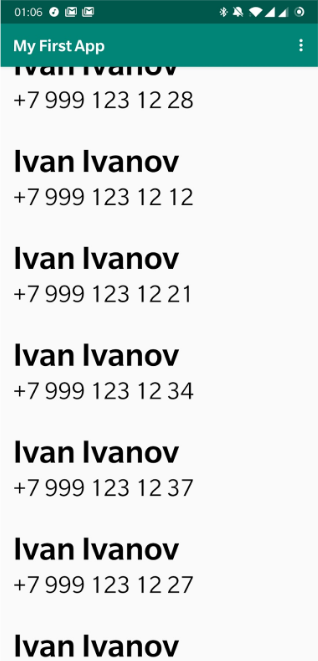
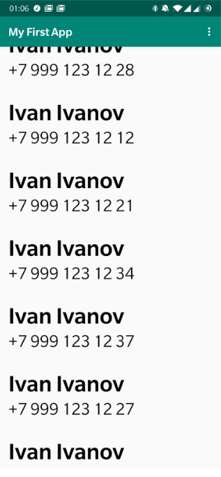

# Список контактов

* Вам потребуется: ![https://gist.github.com/sandwwraith/37dc7beedc7fca85461c4ae4b1ca93a6]
* Работа с разрешениями (READ_CONTACTS)
  - Если разрешения нет, показывать пользователю вменяемое сообщение об ошибке, не падать!
  - После загрузки показывать Toast (или любым другим методом) пользователю с текстом “Найден(о) N контакт(ов)”
  - Можно использовать ![https://github.com/tausiq/demo-contacts-for-Android]
* RecyclerView
* По onClick открывать звонилку с нажатым номером (не начинать вызов)
* Отформатировать как на картинке 

Выравнивание по левому краю, имя больше/жирнее/выделеннее номера

[БОНУС] за прилично выглядящее использование CardView

![https://developer.android.com/guide/topics/ui/layout/cardview]

