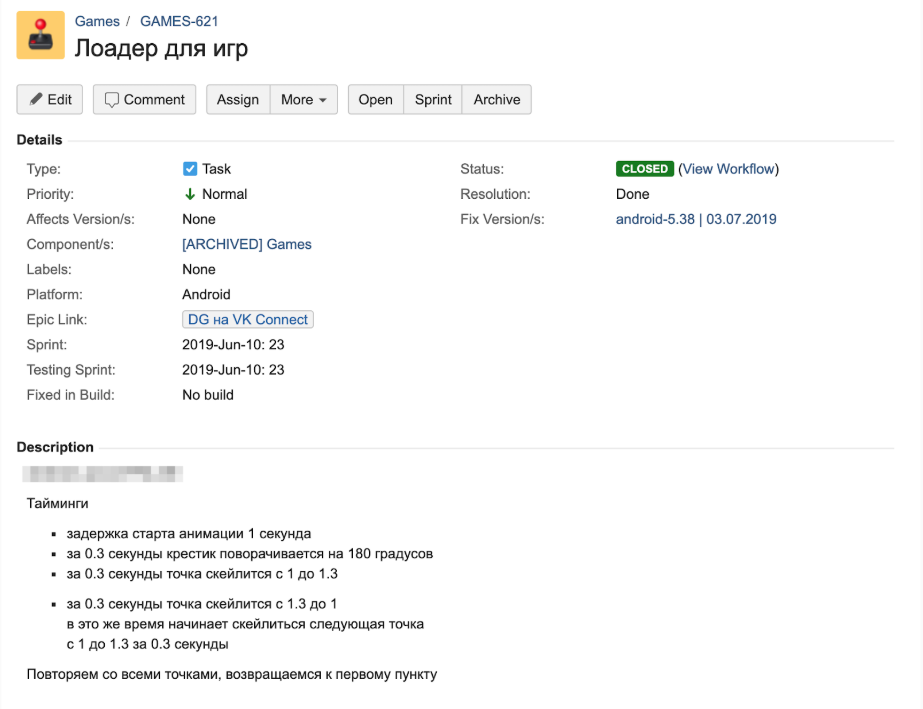
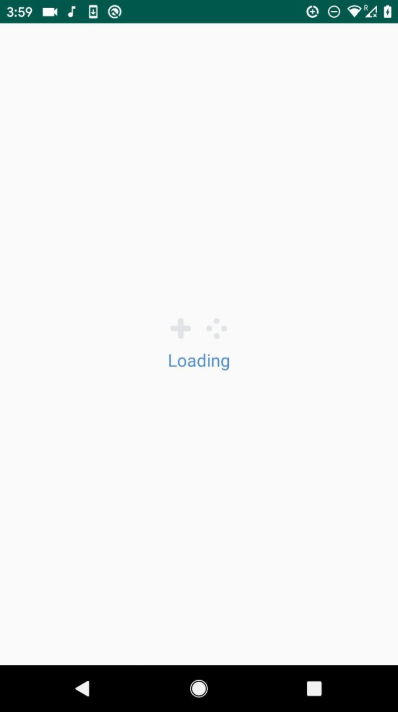
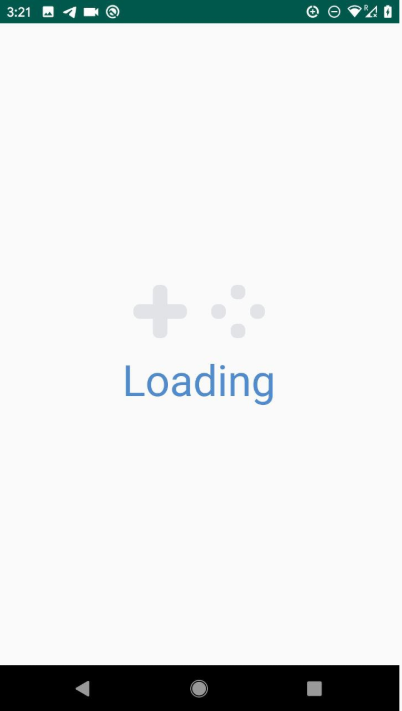

# Анимация загрузки

Выглядеть должно примерно вот [так](https://github.com/gerra/ITMO-Android-19/blob/master/Animations/2019-10-18%2003.56.54.mp4) (это незаскейленная версия) и [так](https://github.com/gerra/ITMO-Android-19/blob/master/Animations/2019-10-18%2003.16.53.mp4) (это заскейленная версия).

У вас должна получиться бесконечно анимирующаяся вьюшка.

Текст просто меняют свою альфу. Между какими значениями -- можете выбрать сами.

То, что выше текста (лоадер) – отдельная вьюшка. Её отрисовка должна выполняться вами на канвасе.

1. Толщина линии крестика, высота и ширина точек – 6dp.
2. Длина линии крестика – 22dp.
3. Точки и линии креста – на самом деле roundRect-ы с радиусом скругления 2.5dp по двум осям.
4. Расстояние по горизонтали и вертикали между верхней и левой точками – 6dp.
5. То есть, по сути, крест вписан в квадрат 22x22 и четыре точки тоже образуют квадрат 22х22. (22=6*11/3).
6. Расстояние между крестиком и левой точкой – 16dp.
7. Цвет – #e1e3e6
8. Я использовал вот такой интерполятор: PathInterpolator(0.25F, 0.1F, 0.25F, 1F)

Бонусы:
* Умение задать толщину линии крестика (она же будет использоваться и для ширины/высоты точек), их радиус скругления (это тоже один параметр и для линий крестика, и для точек), расстояние между крестиком и левой точкой, задержку анимации (это про секунду из описания), длительность анимации (про 0.3 секунды), scaleTo точек (1.3 по дефолту), цвет крестика и точек. Засчитается только при наличии всех 7ми аттрибутов.

Этот бонус засчитается только при наличии первого:
* Сохранение и восстановление стейта при, например, повороте. Анимация должна продолжаться с того же места. При проверке будем передавать вместа 300ms ~5-10 секунд и смотреть, как вы обрабатываете это.

Крайне рекомендую хотя бы попробовать сделать бонусные таски.
