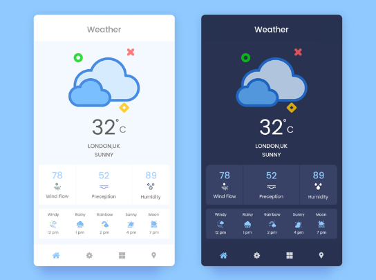

# Экран погоды

Делаем экран погоды:
* Заголовок
* Картинка, поверх текст
* Прогноз на неделю (в линию)

Бонусом: переключение темы (можно добавить специальную кнопку)

_Note_: должно быть красиво не только 
в портретной ориентации!

